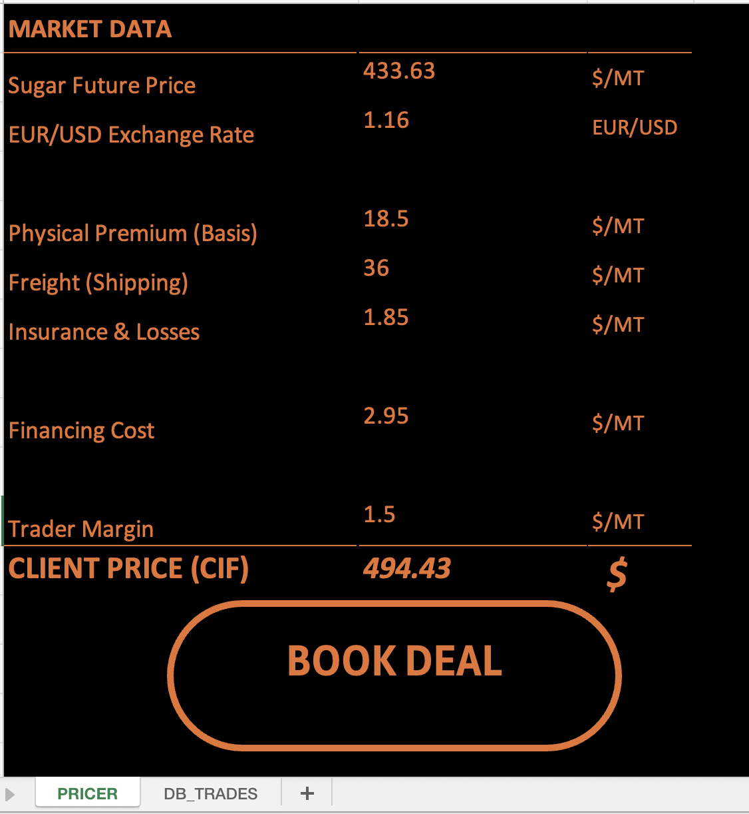
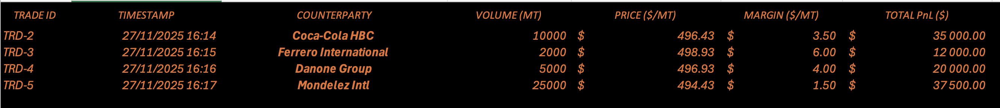

# CommodityTrading-Pricer-VBA
A VBA tool that automates pricing and trade recording.
# Overview
This project is a VBA-based Excel tool designed to simulate the pricing and booking workflow of a commodity trading desk (specifically Sugar Trading). It bridges the gap between raw market data and trade execution log.

# Key Features:
* **Dynamic Pricing:** Calculates Client Price (CIF) based on Futures, Physical Premiums, Freight, and Financing costs.
* **Automated Booking:** VBA script to capture deal details via secured InputBoxes.
* **Trade Log:** Automatically records transactions in a historical database with unique Trade IDs.
* **Bloomberg-Style UI:** Dark mode interface inspired by professional financial terminals for better readability.

# Technologies
* Microsoft Excel
* VBA (Visual Basic for Applications)

# Project Preview

# 1. The Pricing Interface
Calculates the CIF price from market components.

# 2. The Trade Log (Database)
Automatically records confirmed deals with timestamps and P&L.

# Code Snippet
The core logic handles the user input, validates data types to prevent errors, and writes to the database line by line.

`VBA
' Example of the writing logic used in the macro
With wsHist
    .Cells(NextRow, 1).Value = "TRD-" & Format(Now, "YYMM") & "-" & NextRow
    .Cells(NextRow, 2).Value = Now
    .Cells(NextRow, 3).Value = UCase(Counterparty)
    ' ... (See my full code in VBA_Script.vba)
End With

# How to use
Download the Commodity_Trading_Tool.xlsm file.

Enable Macros in Excel.

Go to the PRICER sheet and update market data.

Click BOOK DEAL to execute a trade.

Created by ZEKOVIK Danilo - 2025
